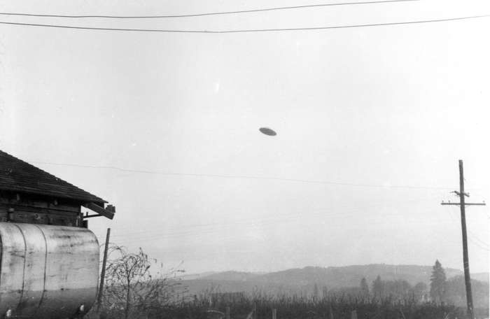

# UFO dataset scraper

<div align="center"></div>

**Descripción**

Esta práctica pertenece a la asignatura _Tipología y ciclo de vida de los datos_, perteneciente al Máster de Ciencia de Datos de la Universitat Oberta de Catalunya. Se aplica la técnica del _Web Scraping_ para conseguir relatos sobre experiencias relacionadas con el fenómeno UFO (http://www.nuforc.org/). El objetivo final de esta práctica será obtener un dataset.

**Miembros del equipo**

La práctica se ha realizado de manera individual por Paula de Jaime.

**Archivos del código fuente**
* **src/main.py:** Fichero que se encarga de inicializar el proceso de _scraping_ y de guardar los datos resultantes a un fichero llamado _ufo_dataset.csv_. Si el usuario introduce por consola la instrucción `python main.py -h` puede consultar los diferentes argumentos **opcionales** que puede introducir:
```
usage: main.py [-h] [-y YEAR] [-o OUTPUT]

UFO Scraper

optional arguments:
  -h, --help            show this help message and exit
  -y YEAR, --year YEAR    The limit year to scrape (default: 1800)
  -o OUTPUT, --output OUTPUT   The output csv file (default: ufo_dataset.csv)
```
* **src/ufo_scraper.py:** Se encarga de _scrapear_ la página web correspondiente, es decir, recopila los relatos de las experiencias UFO y guarda estos en una estructura llamada _dataframe_.
* **src/dataframer.py:** Contiene todos los métodos relacionados con la estructura que se encarga de almacenar los datos llamada _dataframe_.
* **src/exceptions.py:** Fichero que contiene una excepción creada para lanzar errores personalizados.
